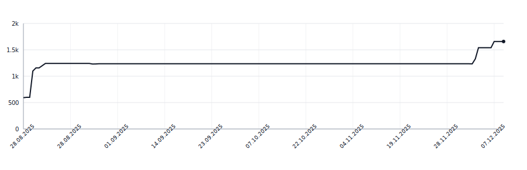

# syllabreak-kotlin

Multilingual library for accurate and deterministic hyphenation and syllable counting without relying on dictionaries.

This is a Kotlin/JVM port of [syllabreak-python](https://github.com/apakabarfm/syllabreak-python) library.

## Supported Languages

- 🇬🇧 English (`eng`)
- 🇷🇺 Russian (`rus`)
- 🇷🇸 Serbian Cyrillic (`srp-cyrl`)
- 🇷🇸 Serbian Latin (`srp-latn`)
- 🇹🇷 Turkish (`tur`)
- 🇬🇪 Georgian (`kat`)
- 🇩🇪 German (`deu`)

## Lines of Code

<picture>
  <source media="(prefers-color-scheme: dark)" srcset=".github/loc-history-dark.svg">
  <source media="(prefers-color-scheme: light)" srcset=".github/loc-history-light.svg">
  
</picture>
