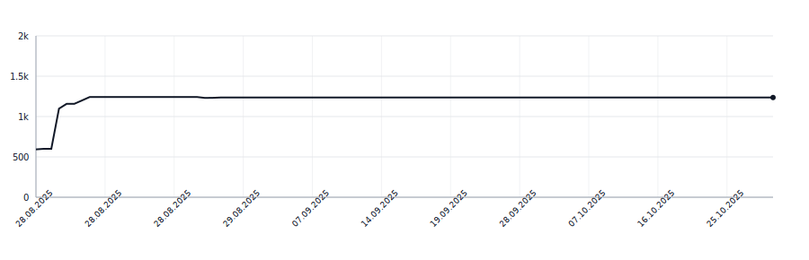

[](https://github.com/apakabarfm/syllabreak-kotlin/actions/workflows/tests.yml)
# syllabreak-kotlin

Multilingual library for accurate and deterministic hyphenation and syllable counting without relying on dictionaries.

This is a Kotlin/JVM port of [syllabreak-python](https://github.com/apakabarfm/syllabreak-python) library.

## Supported Languages

- 🇬🇧 English (`eng`)
- 🇷🇺 Russian (`rus`)
- 🇷🇸 Serbian Cyrillic (`srp-cyrl`)
- 🇷🇸 Serbian Latin (`srp-latn`)
- 🇹🇷 Turkish (`tur`)
- 🇬🇪 Georgian (`kat`)
- 🇩🇪 German (`deu`)

## Installation

Add the dependency to your `build.gradle.kts`:

```kotlin
dependencies {
    implementation("fm.apakabar:syllabreak-kotlin:0.2.0")
}
```

## Usage

### Auto-detect language

When no language is specified, the library automatically detects the most likely language:

```kotlin
import fm.apakabar.syllabreak.Syllabreak

val s = Syllabreak("-")
println(s.syllabify("hello"))        // "hel-lo"
println(s.syllabify("здраво"))       // "здра-во" (Serbian Cyrillic)
println(s.syllabify("привет"))       // "при-вет" (Russian)
```

### Specify language explicitly

You can specify the language code for more predictable results:

```kotlin
val s = Syllabreak("-")
println(s.syllabify("problem", "eng"))      // "pro-blem" (Force English rules)
println(s.syllabify("problem", "srp-latn")) // "prob-lem" (Force Serbian Latin rules)
```

This is useful when:
- The text could match multiple languages
- You want consistent rules for a specific language
- Processing text in a known language

### Language detection

You can detect languages that match the input text:

```kotlin
val s = Syllabreak()
println(s.detectLanguage("hello"))   // ["eng"]
println(s.detectLanguage("здраво"))  // ["srp-cyrl"]
println(s.detectLanguage("привет"))  // ["rus"]
```

### Custom soft hyphen

By default, the library uses the Unicode soft hyphen (`\u00AD`), but you can customize it:

```kotlin
val s = Syllabreak("|")  // Use pipe as separator
println(s.syllabify("syllabification"))  // "syl|la|bi|fi|ca|tion"
```

## Lines of Code

<picture>
  <source media="(prefers-color-scheme: dark)" srcset=".github/loc-history-dark.svg">
  <source media="(prefers-color-scheme: light)" srcset=".github/loc-history-light.svg">
  
</picture>
